# Library Management System API

This document outlines the objects, attributes, and endpoints for the Library Management System API.

## Objects and Their Attributes

### Book

- `title` (String): The title of the book.
- `author` (ObjectId): Reference to an Author.
- `isbn` (String): Unique identifier for the book.
- `availableCopies` (Number): Number of available copies of the book.
- `borrowCount` (Number): Tracks the number of times the book has been borrowed.

### Author

- `name` (String): Name of the author.
- `email` (String): Unique email of the author (validated format).
- `phoneNumber` (String): Valid phone number starting with 03 and consisting of 11 digits.

### Borrower

- `name` (String): Name of the borrower.
- `borrowedBooks` (Array): List of ObjectIds referencing borrowed books.
- `membershipActive` (Boolean): Status of the borrower’s membership.
- `membershipType` (String): Either `standard` (limit: 5 books) or `premium` (limit: 10 books).

### Endpoints List with Screenshots

#### Books

1. `POST` Add Book  
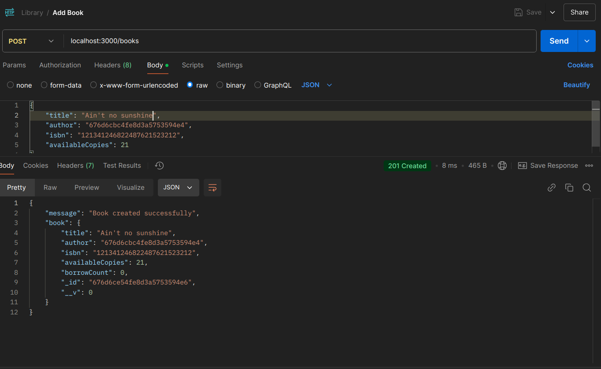

2. `GET` Get Books  
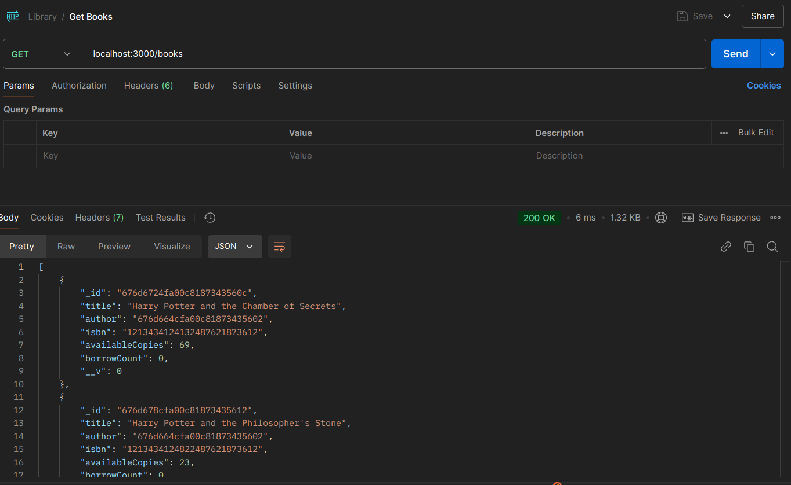

3. `PUT` Update Book  
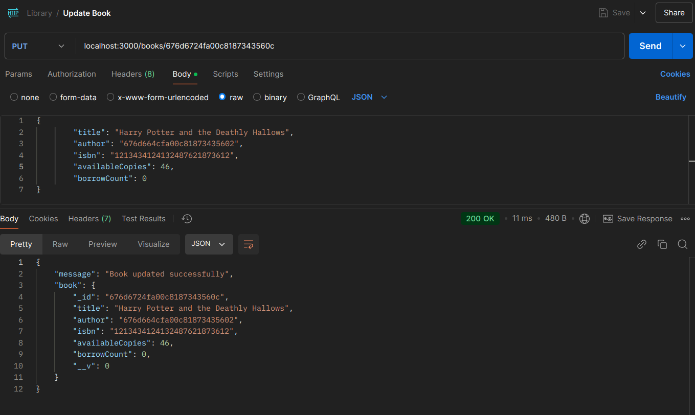

4. `DELETE` Delete Book  
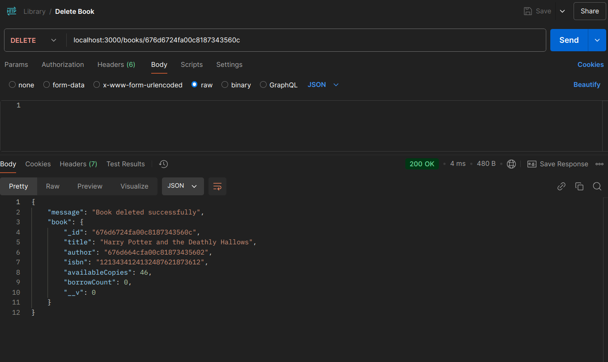

5. `POST` Borrow Book  
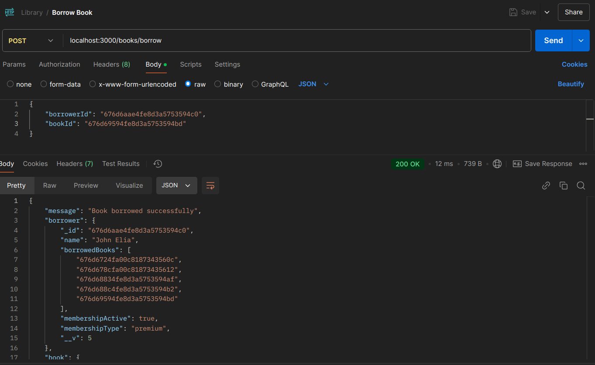

6. `POST` Return Book  
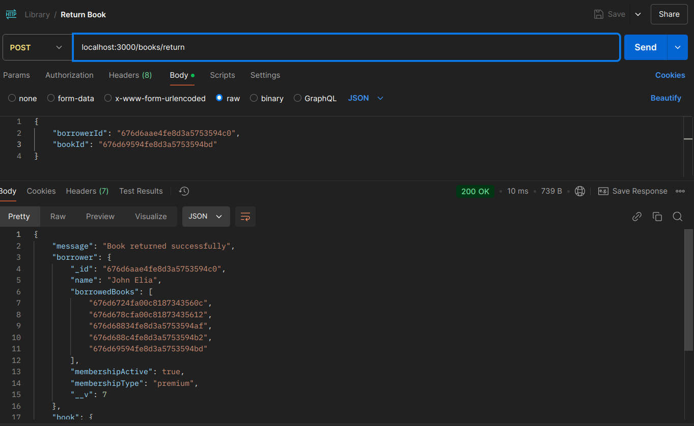

#### Authors

7. `POST` Add Author  
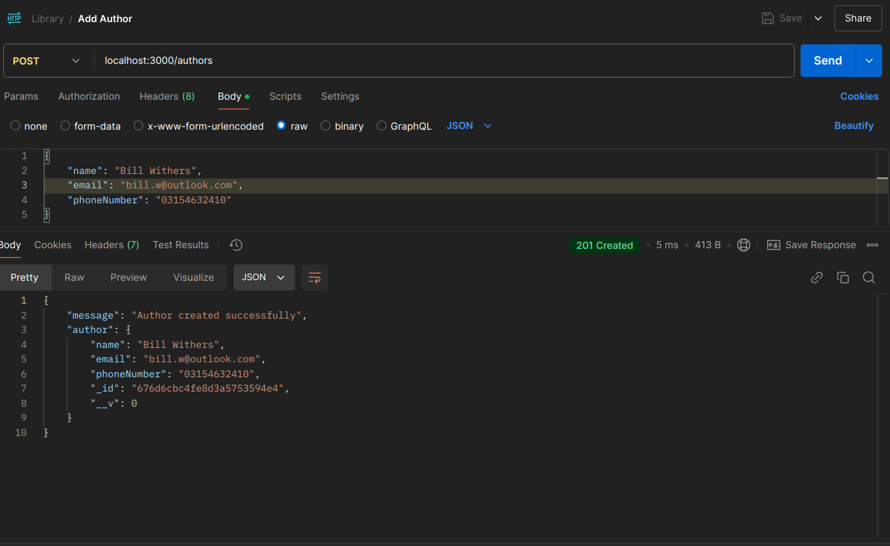

8. `GET` Get Authors  
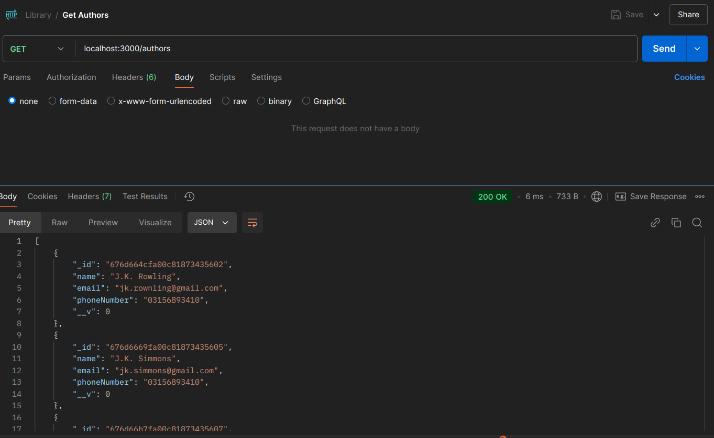

9. `PUT` Update Author  
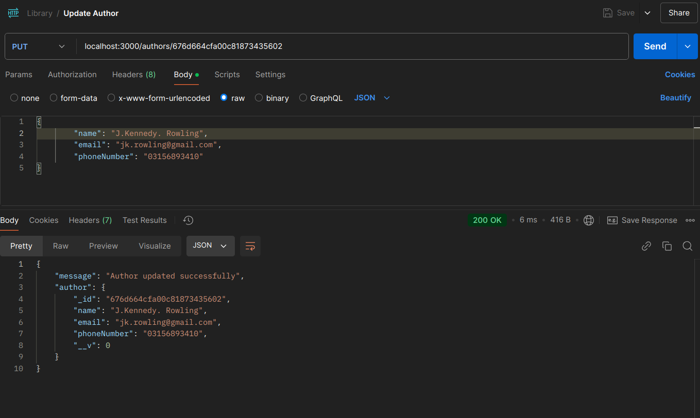

10. `DELETE` Delete Author  
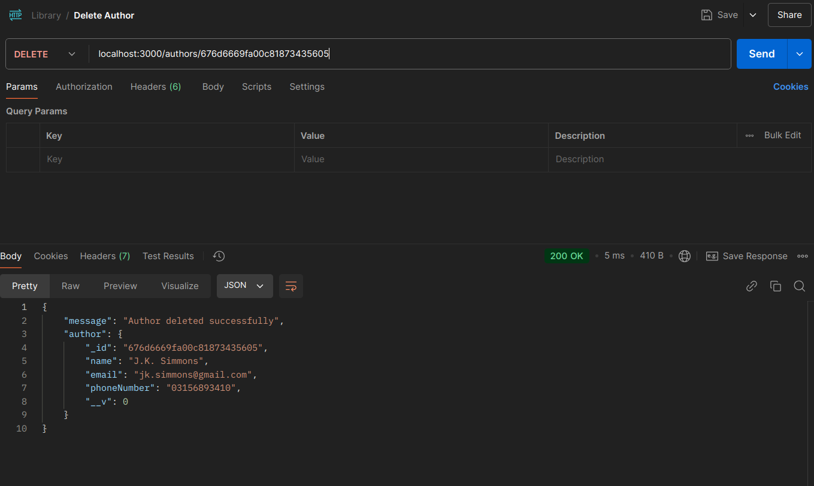

#### Borrowers

11. `POST` Add Borrower  
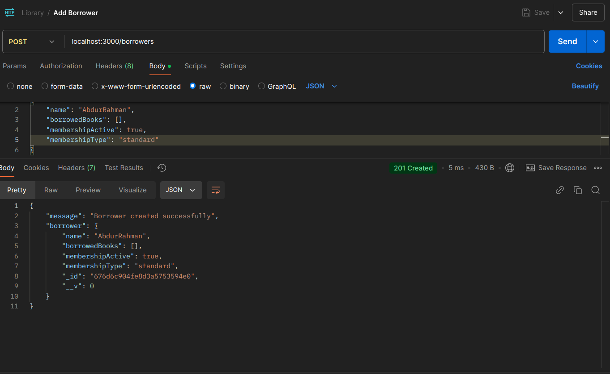

12. `GET` Get Borrowers  
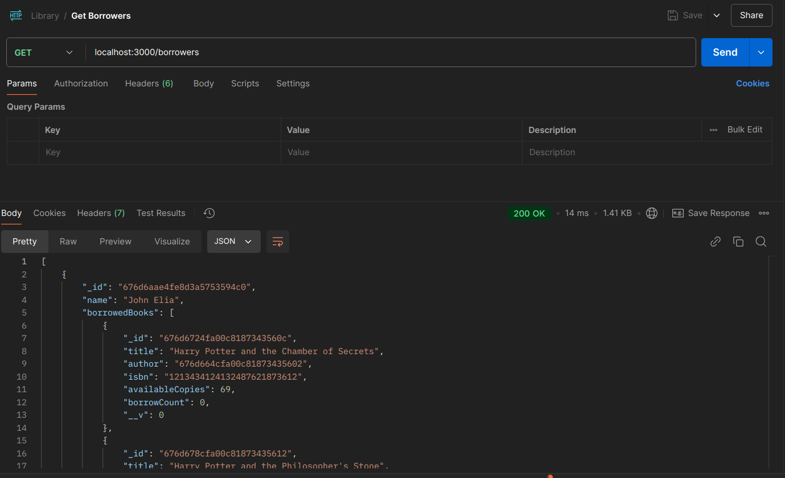

13. `PUT` Update Borrower  
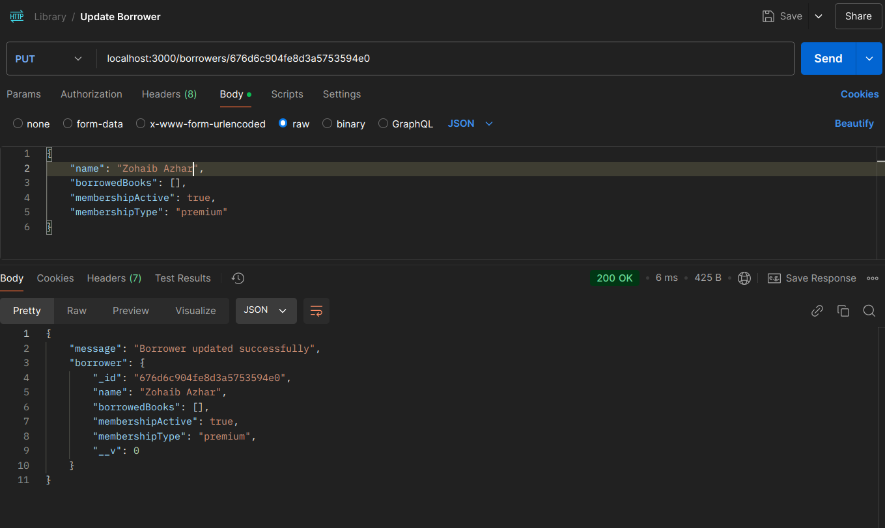

14. `DELETE` Delete Borrower  
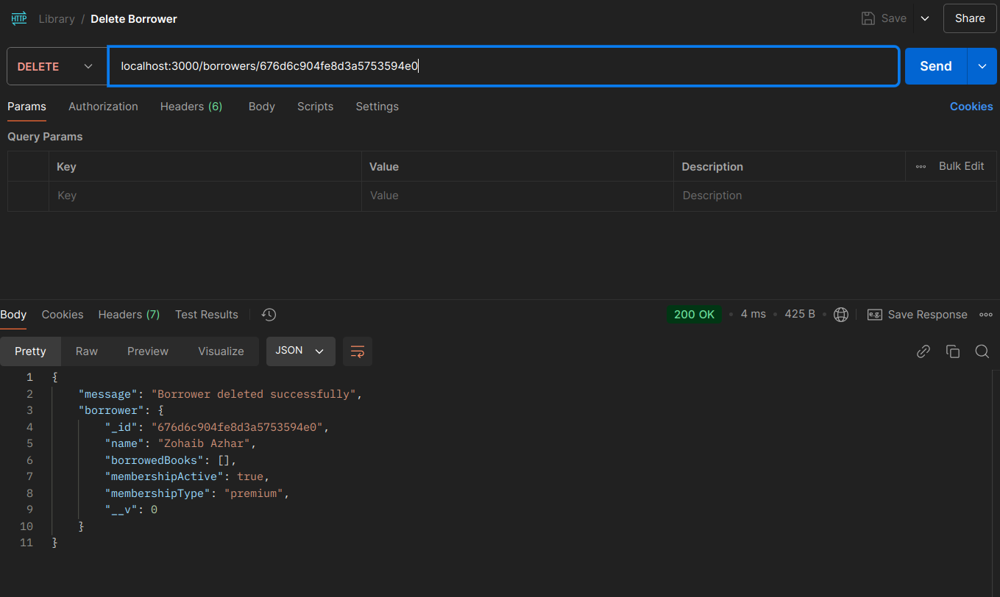

### Notes

- **Validation**: All endpoints validate the inputs before saving or updating records.

- **Relationships**: Books are referenced by Author and Borrower objects via `ObjectId` references.

- **Membership Limits**: Borrowers have borrowing limits based on their membership type:
  - `standard`: Up to 5 books.
  - `premium`: Up to 10 books.
